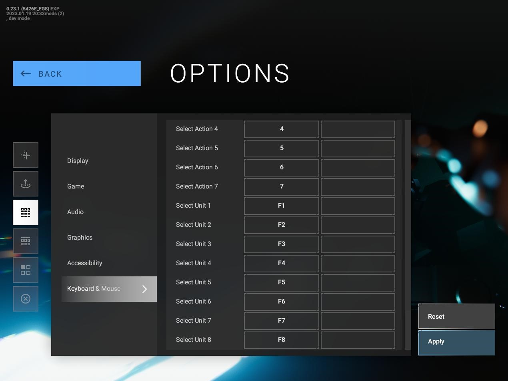

# UnitSelectionFKeys

A library mod for [Phantom Brigade (Alpha)](https://braceyourselfgames.com/phantom-brigade/) that brings back using the function keys F1-F8 to select units in combat. It skips disabled/destroyed units so it matches the unit tab display. If there are more than 8 units in combat, you'll have to use the tab key or the mouse to select units 9 and above.

It is compatible with game patch **0.23.1-b5426**. That is an **EXPERIMENTAL** release. All library mods are fragile and susceptible to breakage whenever a new version is released.

I've packaged up a ready-to-use mod as a release. Just download and extract to your mod folder.  See this [detailed guide](https://github.com/NBKRedSpy/PB_EquipmentTypeRarity#installation) about how to enable and install mods in Phantom Brigade.

The keys can be remapped. Here's a screenshot of the new key remapping screen that ships with patch 0.23.1-b5426 showing the extra unit selection actions added by this mod and their default assignment to the function keys.

## Technical Notes

Phantom Brigade is using the excellent [Rewired](https://guavaman.com/projects/rewired/) Unity asset to manage controller input. Unfortunately, Rewired isn't expecting actions to be added at runtime outside its Editor interface. I've had to inject the new unit selection actions into an internal data structure and then mash the reset button on Rewired to get the actions to take. It's generally not a good idea to reset Rewired during game play. However, I'm doing it fairly early on and I think I've caught all the places using a Rewired player so it seems to work.

The upside is that the key remapping that BYG just added to the game works for these new actions. You should be able to remap to mouse buttons as well but I don't have a fancy gaming mouse with a bazillion buttons to test it out.
